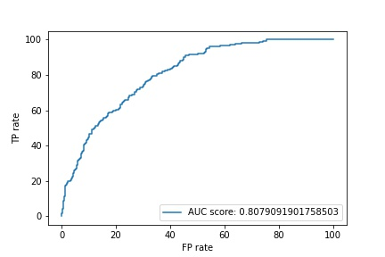

# ISIC-melanoma-classification

Requirements:

## Training

'''
python train.py --enet-type res_net --n-epochs 10
python train.py --enet-type eff_net --n-epochs 10
python train.py --enet-type vgg16 --n-epochs 10
'''
Trained on AWS, with TF using pretrained VGG16, ResNet, EfficientNet.

## Predictions

'''
python predict.py --enet-type res_net 
python predict.py --enet-type eff_net
python predict.py --enet-type vgg16
'''

## Ensembling
'''
python ensemble.py
'''

## Evaluation

'''
python evaluate.py
'''

## Visual output
Plot ROC curve, AUC score.

