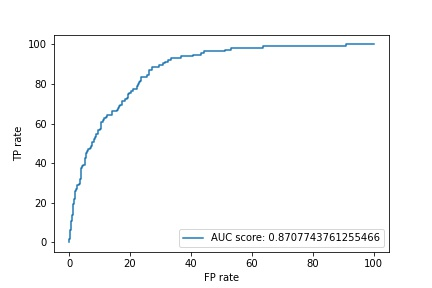

# SIIM-ISIC melanoma classification
https://www.kaggle.com/c/siim-isic-melanoma-classification

## Goals and dataset
The goal is to predict whether a skin lesion is malignant or benign, based on its photograph.

We downloaded data in tfrec format prepared by Chris Deotte:
https://www.kaggle.com/c/siim-isic-melanoma-classification/discussion/173639

Namely, we use the '2020 Dataset' with resolution 256x256 :

https://www.kaggle.com/cdeotte/melanoma-256x256

and also consider an additional sample of 4000 malignant-only images (256x256 resolution):

https://www.kaggle.com/cdeotte/malignant-v2-256x256 

The '2020 Dataset' contains 33,126 images for training of which only 584 (1.8%) are malignant, resulting in high imbalance.

Training was run on an AWS instance using Tensorflow by re-training the last layers of pretrained models (ResNet50, EfficientNetB4 and VGG16) and ensembling the final predictions.

The output from the training epochs can be found in [03-main-training.ipynb](03-main-training.ipynb). 

Python packages requirements: [requirements.txt](requirements.txt)

## Training summary
We initially tried several different types of architectures: 
1. ResNet50
2. VGG16
3. EfficientNetB4, EfficientNetB3

The best performing architecture in terms of validation AUC was EfficientNetB4.

As the next step we continued with EfficientNetB4 and experimented with
1. adding additional 4000 examples of malignant-only images to the training data
2. using a learning rate scheduler

```
python train.py --enet-type ResNet --n-epochs 10
python train.py --enet-type vgg16 --n-epochs 10
python train.py --enet-type EfficientNet --n-epochs 10
python train.py --enet-type EfficientNet --n-epochs 10 --add-malig True
```

## Predictions
Compute predictions for each model. 

```
python predict.py --enet-type EfficientNet
```

<!-- 
## Ensembling
The predictions from the three models were ensembled into final predictions.

```
python ensemble.py
```

## Evaluation

```
python evaluate.py
```
-->

## ROC curve of EfficientNetB4



### Further improvements:
- train on higher resolution images
- implement data augmentation
- encorporate meta data
