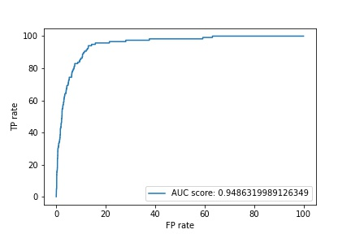

# ISIC-melanoma-classification

The goal is to predict whether a mole is a malignant or benign, based on its image.

We used approximately 13000 images for training (the full SIIM-ISIC dataset has around 30000 images).

Software requirements: see [requirements.txt](requirements.txt)

## Training

```
python train.py --enet-type res_net --n-epochs 10
python train.py --enet-type eff_net --n-epochs 10
python train.py --enet-type vgg16 --n-epochs 10
```
Trained was run on an AWS instance in tensorflow using with pretrained nets ResNet and EfficientNet and VGG16.

## Predictions
Compute predictions for each model. 

```
python predict.py --enet-type res_net 
python predict.py --enet-type eff_net
python predict.py --enet-type vgg16
```

## Ensembling
The predictions from the three models were ensembled into final predictions.

```
python ensemble.py
```

## Evaluation

```
python evaluate.py
```

## Visual output
Plot ROC curve, AUC score.


